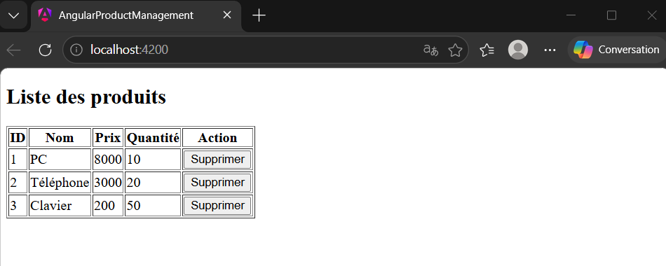

# AngularProductManagement

This project was generated using [Angular CLI](https://github.com/angular/angular-cli) version 21.2.7.

## Description

Ce projet est une application web développée avec Angular permettant la gestion de produits.
Il s'agit d'un TP visant à comprendre les concepts de base d’Angular moderne (standalone components, services, routing).

---

## Fonctionnalités réalisées

* ✔ Affichage de la liste des produits
* ✔ Utilisation d’un service pour gérer les données
* ✔ Suppression d’un produit
* ✔ Architecture basée sur les composants (Component / Service / Model)
* ✔ Routing avec Angular

---

## Technologies utilisées

* Angular (Standalone Components)
* TypeScript
* HTML / CSS

---

## Lancer le projet

```bash
npm install
ng serve
```

Puis ouvrir :
http://localhost:4200

---

## Avancement du TP

Jusqu'à présent, j’ai mis en place l’environnement de développement Angular et créé la structure de base de l’application en utilisant des composants standalone. J’ai développé un service pour gérer les données des produits, ainsi qu’un modèle représentant un produit. Ensuite, j’ai implémenté l’affichage de la liste des produits à l’aide d’un composant dédié, en utilisant le routing pour la navigation. Enfin, j’ai ajouté une fonctionnalité permettant de supprimer un produit depuis l’interface utilisateur.




---

